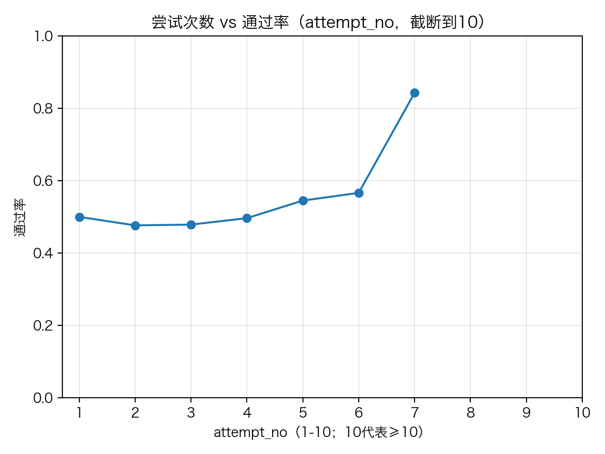
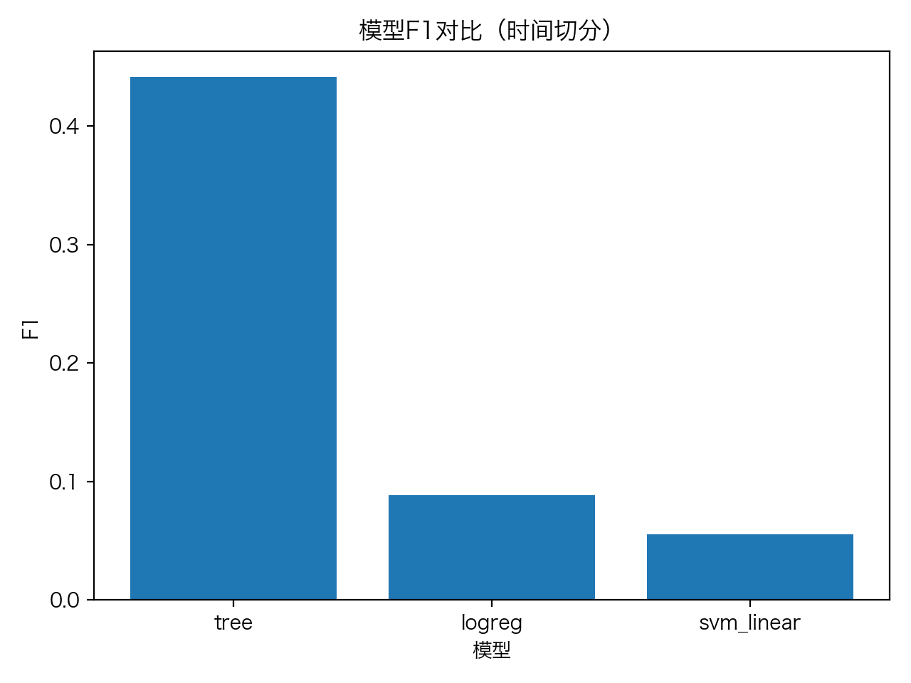

# 2 基于监督学习的OJ题目推荐技术的应用研究

## 2.1 实际问题描述

本项目是基于本人的毕业设计实现的一套算法题目推荐系统。系统面向 Online Judge（OJ）学习场景，目标是根据学生的历史做题行为，为其在题库中推荐“下一步更值得做”的题目，并用离线实验给出可复现的指标与图表支撑。

从技术路线看，本项目把推荐问题拆解为“预测 + 排序”的闭环：

1. **通过率预测（监督学习）**：把“某次提交是否 AC”建模为二分类问题，学习一个预测函数输出 `P(AC)`。
2. **Top‑K 推荐**：对每个用户从候选题集中计算 `P(AC)` 并排序，输出 Top‑K 列表；同时支持“成长型推荐”规则（推荐 `P(AC)` 处于适中区间的题，避免只推极易题或极难题）。
3. **离线评估（严格无泄漏）**：按 `submission_id` 做时间切分（前 80% 训练、后 20% 测试），训练窗只用于训练模型/统计画像；测试窗只用于评估命中（ground truth），避免“看未来”导致指标虚高。

对应的两个核心任务定义如下：

### 2.1.0 记号与符号说明

为便于阅读，本文对出现的主要数学记号作统一说明：

- `u`：用户（学生）标识；`U` 表示用户集合。
- `p`：题目（problem）标识；`P` 表示题目集合（与概率符号 `P(·)` 语义不同，需结合上下文区分）。
- `t`：交互发生的时间点或序列位置（用于强调“只用历史信息”）。
- `x(u,p,t)`：用户 `u` 在时间 `t` 针对题目 `p` 的特征向量（由用户侧、题目侧与交互侧特征组成）。
- `y ∈ {0,1}`：监督学习标签；`y=1` 表示该次提交通过（AC），`y=0` 表示未通过。
- `P(AC | x(u,p,t))`：在特征 `x(u,p,t)` 条件下“通过（AC）”事件发生的条件概率，由分类模型输出。
- `P(AC)`：通过概率的简写。在本文叙述中常作为“模型输出的通过概率评分”的统称，严格来说可理解为对条件概率 `P(AC | x)` 的简写。
- `p_ac = P(AC | u,p)`：用于推荐排序的通过概率评分（可视为将时间相关特征折叠进用户画像后的打分写法）。
- `K`：推荐列表长度；Top‑K 表示按评分从高到低取前 `K` 个题目。
- `[a,b]`：闭区间；例如 `[0.4,0.7]` 表示成长型推荐所采用的“适中通过概率”区间。
- `->` / `→`：表示流程/数据流的先后顺序（例如“数据预处理 → 特征构造 → 建模评估”）。
- Hit@K：命中率指标。对每个用户，若其 Top‑K 推荐列表中至少包含 1 道在测试时间窗内最终通过（AC）的题目，则记为命中；对所有用户取平均。
- Precision@K：精确率指标。对每个用户，Top‑K 推荐列表中“命中最终通过题目”的比例（命中数除以 `K`）；对所有用户取平均。
- Accuracy / Precision / Recall / F1：分类评估指标，其中 `F1 = 2 * Precision * Recall / (Precision + Recall)`。

### 2.1.1 预测任务（Pass Prediction）

给定用户 `u` 与题目 `p` 以及该次交互的上下文特征 `x(u,p,t)`，预测本次提交是否 AC：

- 标签 `y ∈ {0,1}`：`y=1` 表示 AC，`y=0` 表示未 AC。
- 输出概率：模型预测 `P(AC | x(u,p,t))`，用于后续推荐排序。

### 2.1.2 推荐任务（Top‑K Recommendation）

对每个用户生成一个长度为 K 的题目列表，期望在测试时间窗内能“命中”用户最终 AC 的题目：

- 输入：用户历史已做/已 AC 题目集合与候选题目集合。
- 输出：Top‑K 题目列表（按模型分数排序，可叠加规则过滤）。
- 目标：提高 Hit@K（以及 Precision@K）。

### 2.1.3 场景约束与挑战

- 时间顺序：推荐时只能使用历史信息，离线评估必须避免未来信息泄漏。
- 冷启动：新用户/新题目缺少历史，特征可用性有限（本项目以可复现流程为主，后续可扩展）。
- 多样性/覆盖度：避免推荐过度集中在少数“热门题”或“极易题”。

---

## 2.2 数据来源说明

### 2.2.1 原始数据来源

本项目的题库原始数据来自以下开源数据仓库下载：

https://gitcode.com/open-source-toolkit/0972f/

下载后得到离线题库素材包（包含题面网页/HTML 等内容）。本文对原始题库进行离线解析与格式化，抽取题目标题、题面文本、样例输入输出、时间/内存限制等字段，并进一步补全难度与算法标签（可选），最终形成可用于建模训练的结构化标准表。

### 2.2.2 数据处理与生成的工具链（Utils）

从原始题库素材到可训练数据的主要处理环节如下：

1. **离线解析题库 HTML → CSV**  
将题面 HTML 解析为结构化题目表，抽取标题、题面描述、样例、限制条件等核心字段，并进行编码与格式规范化。

2. **AI 打标签与难度（可选但推荐）**  
基于题面文本对题目进行难度评估与算法类型多标签标注；标注完成后进行合并与规范化，保证标签集合与格式稳定，便于下游特征构造与可解释分析。

#### 2.2.2.1 AI 标注流程与质量控制（论文说明）

为确保 AI 标注结果“可用、可控、可追溯”，本项目在 prompts 约束、输出校验、失败修复与后处理环节做了明确设计：

1) **强约束的输出格式（prompts 与 system prompt）**  
通过提示词与系统约束要求模型仅输出一行结构化结果，字段固定为 difficulty 与 tags：difficulty 为 1–10 的整数；tags 为 1–2 个标签，且必须来自预先定义的候选标签集合（白名单）。该约束可显著减少解释性文本、代码块等噪声输出。

2) **白名单与结构化解析校验**  
对模型输出进行结构化解析与严格校验：若出现非结构化输出、字段不匹配、难度越界或标签不在白名单等情况，则判为无效结果并进入失败处理流程；仅保留通过校验的标注用于后续合并。

3) **失败重试与“自动纠错（repair）”机制**  
当输出不符合格式要求时，系统会重申输出约束并进行有限次数的纠错重试，以降低“格式错误/标签不合法”带来的无效率。

4) **可追溯的断点续跑与错误记录**  
将成功与失败的标注结果分别记录，支持断点续跑，并可回溯到单题的原始输出与失败原因，便于人工抽查与质量审计。

5) **后处理合并与格式规范化**  
将标注结果合并回题目表，并对标签字段进行统一的格式规范化与白名单过滤，保证下游特征展开维度稳定。

补充说明：AI 标注步骤需要网络与 API Key 支持；在无网络环境下可跳过标注环节，保留已有标签或采用规则/人工方式补全。

3. **行为日志与字典表生成（为训练提供 submissions）**  
本文的训练与推荐需要用户提交日志。在仅有题库而缺少真实提交日志的情况下，本项目提供两类可复现的数据构造方案：  
- **多因素相关模拟（主方案）**：显式模拟用户能力、题目难度、偏好匹配以及多次尝试带来的学习效应，并同步生成运行时间/内存等辅助字段，使日志分布更贴近 OJ 场景。  
- **最小可运行模拟（备选）**：快速生成基本的用户、语言、判题结果与提交记录，用于验证端到端流程可运行。

4. **一致性校验（门禁）**  
对标准表进行外键、值域、顺序与异常值等一致性校验，作为进入建模阶段的质量门禁。

### 2.2.3 CleanData 标准表与规模

清洗后的数据以标准表形式组织，关键表包括题目表（题目元信息、难度与标签等）、提交记录表（用户—题目交互、判题结果与尝试次数等）、用户表（用户主键与基础信息/画像占位），以及标签/语言/判题结果等字典表，用于约束枚举取值空间并保证特征展开维度稳定。

当前实验数据规模（以本项目现有数据统计为准）：

- 用户数：1000
- 题目数：10491
- 提交数：300000
- 标签类别数：12
- 语言类别数：6
- 判题结果类别数：5
- AC 占比（通过率）：约 49.36%

*图2-1 用户活跃度分布：可以观察到提交次数存在明显长尾，这也是推荐系统常见的现象（少数高活跃用户贡献大量交互）。*

---

## 2.3 问题求解

本节对应“数据预处理（清洗、标准化、特征构造）→ 模型选择与训练 → 评估与选型 → 推荐生成与评估 → 可解释性图表”的完整闭环。

### 2.3.1 数据预处理与约束校验

在进入特征构造与模型训练前，本文对清洗数据进行一致性与约束校验，确保标准表满足建模所需的基本质量要求。核心校验点包括：

- **外键一致性**：提交记录中的用户标识必须能在用户表中找到，题目标识必须能在题目表中找到；编程语言与判题结果等枚举字段必须能在对应字典表中匹配。
- **值域约束**：题目难度应落在预设区间（允许缺失，后续采用一致规则补全）；通过标签为二值变量且与判题结果一致；尝试次数为正整数，并在同一用户—题目对内严格递增。
- **顺序与异常**：检查主键唯一性、缺失率与异常值（如不可解析字段），并对不满足约束的记录按规则剔除或修正。

### 2.3.2 特征构造（无泄漏）

本文以“用户—题目”的一次提交交互作为一个监督学习样本，标签为该次提交是否通过（AC）。为保证离线实验可信，特征构造严格遵循时间因果：对任意一条提交样本，仅使用该提交发生之前的历史信息计算用户侧统计量与偏好画像，不使用未来提交产生的信息，从而避免信息泄漏导致的指标虚高。

特征设计强调三点：**可解释性**（便于从学习行为角度理解模型）、**可复现性**（字段定义与取值空间稳定）、**无泄漏**（严格按时间窗生成动态特征）。结合本项目数据结构，主要特征类别如下：

- **用户侧动态特征**：由历史提交聚合得到，用于刻画用户的当前水平与学习状态，例如能力水平、坚持度/活跃度等。
- **题目侧特征**：以题目难度为核心；当难度缺失时采用一致规则进行补全，得到可用于建模的难度特征。
- **交互侧特征**：反映当前交互上下文，例如对同一题目的第几次尝试（尝试次数），用于刻画“多次尝试带来的学习效应”。
- **匹配特征与稀疏编码**：对编程语言与算法标签进行稀疏表示（语言 one‑hot、标签 multi‑hot），并构造语言/标签匹配程度等交互特征，以增强模型对“偏好一致性”的刻画能力。

为验证特征合理性，本文对关键字段进行分布与相关性可视化检查：整体上难度与通过率呈负相关（见图2-2），尝试次数与通过率呈上升趋势（见图2-3），与 OJ 学习场景直觉一致，说明难度字段与学习效应特征具有有效信号。

*图2-2 难度 vs 通过率：整体呈负相关，可作为难度字段有效性的合理性检验。*

*图2-3 尝试次数 vs 通过率：可观察到学习效应（多次尝试后通过概率上升）的趋势。*

### 2.3.3 模型选择、训练与评估

#### 2.3.3.1 训练/测试切分（时间切分）

采用按提交序列先后（以 submission_id 递增近似时间顺序）的时间切分（80%/20%）：
- 训练集：较早的 80% 提交
- 测试集：较晚的 20% 提交

该切分方式更贴近线上“用过去预测未来”的使用方式，也能暴露“是否使用了未来信息”的问题。

#### 2.3.3.2 候选模型与选型依据

候选模型：
- Logistic Regression（可输出概率）
- Linear SVM（线性强基线）
- Decision Tree（非线性对比）

评价指标：
- 分类指标：Accuracy / Precision / Recall / F1（优先看 F1）
- 图表：混淆矩阵（辅助解释错误类型）

离线评估结果如下：

| 模型 | Accuracy | Precision | Recall | F1 |
| --- | ---:| ---:| ---:| ---:|
| Logistic Regression | 0.683 | 0.681 | 0.670 | 0.675 |
| Linear SVM | 0.683 | 0.681 | 0.669 | 0.675 |
| Decision Tree | 0.674 | 0.672 | 0.661 | 0.666 |

结论：Logistic Regression 在 F1 上略优（或与 Linear SVM 接近），且能输出通过概率 `P(AC)`，便于直接用于推荐排序，因此选为后续推荐模块的主模型。

*图2-4 模型 F1 对比：用于直观比较不同模型的综合分类性能。*

*图2-5 混淆矩阵：直观看到误判结构，辅助分析特征不足与决策阈值敏感性。*

### 2.3.4 Top‑K 推荐生成与离线评估

推荐流程：
1. 训练通过率预测模型，输出每个用户—题目对的通过概率 `p_ac = P(AC | u,p)`。
2. 对每个用户构造候选集：从其历史未通过的题目中筛选候选题，并剔除已通过题目。
3. 为候选题打分并排序：按 `p_ac` 由高到低得到 Top‑K 推荐列表。
4. 规则增强（成长型推荐）：优先选择 `p_ac` 位于适中区间（本文设置为 `[0.4,0.7]`）的题目，避免推荐结果长期偏向“过易题”或“过难题”，更贴近循序渐进的学习目标。

离线评估指标（测试窗 ground truth）：
- **Hit@K**：Top‑K 中是否至少有 1 道题在测试时间窗内被该用户最终通过（AC）。
- **Precision@K**：Top‑K 中命中最终通过题目的比例。

在严格时间切分口径下（训练集为较早 80%，测试集为较晚 20%），推荐评估结果如下：

| K | Hit@K | Precision@K |
| ---:| ---:| ---:|
| 1 | 0.004 | 0.004 |
| 3 | 0.014 | 0.0047 |
| 5 | 0.035 | 0.0074 |
| 10 | 0.082 | 0.0100 |

*图2-6 Hit@K 曲线：用于观察不同 K 下的命中率增长趋势，并据此选择合适的推荐列表长度。*

### 2.3.5 覆盖度/集中度与可解释性分析

为避免“只推荐少数题/热门题”，本文从覆盖度与集中度角度对推荐结果进行分析：统计不同题目被推荐的次数分布，以观察推荐是否过度集中在少数题目；若集中度过高，则存在同质化风险，需要在候选生成或排序阶段加入多样性约束或业务规则。覆盖度/集中度的可视化结果见图2-7。

同时，为增强可解释性，本文给出单用户的推荐难度分布示例（图2-8），用于检查推荐题目的难度区间是否与用户历史水平相匹配，以及成长型推荐规则是否有效抑制“极端难度”题目占比。

*图2-7 覆盖度/集中度：若推荐过度集中在少数题，说明存在同质化风险，需要加入多样性约束或业务规则。*

*图2-8 单用户案例：用于检查推荐是否过度偏简单或过难，并与该用户历史做题难度对照。*

---

# 3 总结

本文完成了一个面向 OJ 学习场景的题目推荐系统离线研究闭环：从题库解析与清洗出发，构建标准化题目数据；在交互日志可得或可构造的前提下，完成特征构造、监督学习建模、Top‑K 推荐生成以及严格无泄漏的离线评估，并输出相应图表用于诊断与解释。通过本次实现，我的主要收获与体会包括：

- 能把监督学习的流程落到工程可复现产物：数据→特征→模型→评估→推荐→可视化；
- 深刻理解“时间切分与信息泄漏”对离线指标的影响，并用严格口径保证评估可信；
- 学会用可解释特征（难度、尝试次数、偏好匹配）与图表联动分析模型与推荐表现。

在课设/实现过程中遇到的主要困难与解决方案：

1) **原始题库格式不统一（HTML 结构差异、字段缺失、编码问题）**：采用离线解析与统一字段抽取，将非结构化题面转换为结构化题目数据，并对文本与限制字段进行标准化。  
2) **难度与标签缺失/格式不一致**：设计可控的标签体系与难度尺度，并在需要时引入辅助标注与后处理规范化，确保输出符合固定结构与白名单约束，从而支持稳定的特征展开。  
3) **缺少真实提交日志**：在无法获得真实日志的条件下，构造具有行为相关性的模拟交互数据（能力—难度—偏好匹配—多次尝试学习效应），以保证训练与推荐流程可运行且可复现。  
4) **推荐偏简单/同质化**：在排序阶段引入成长型推荐约束，并通过覆盖度/集中度与难度分布等可解释分析手段进行诊断。

后续可改进方向：
- 引入更贴近真实的公开日志数据或更精细的行为生成机制（遗忘效应、题目质量差异等）。
- 尝试更强的非线性模型（GBDT/XGBoost）或加入序列特征，以刻画能力随时间变化。
- 在推荐列表中加入多样性约束与冷启动策略，提升覆盖度与长期学习收益。
